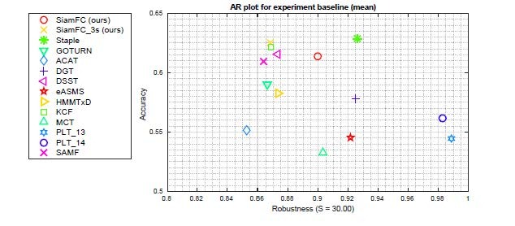
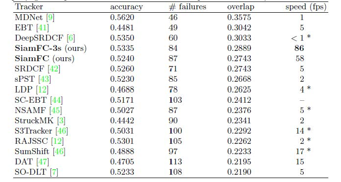
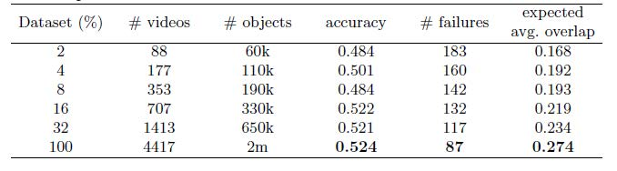

[TOC]

# SiameseFC 阅读笔记

在目标视觉跟踪（Visual Object Tracking）任务中，准确率（accuracy）和速度（speed）是该任务的两座大山。如何在保证较高准确率的情况下，做到实时跟踪目标，SiameseFC这篇文章使用孪生网络较好的达成了两者之间的平衡。

原文地址传送门：[Fully-Convolutional Siamese Networks for Object Tracking](https://www.robots.ox.ac.uk/~luca/siamese-fc.htmlt)

代码地址传送门：

- [Tensorflow-Tracker](https://github.com/torrvision/siamfc-tf)

- [Tensorflow-Training-Tracker](https://github.com/bilylee/SiamFC-TensorFlow)

- [Pytorch-Training-Tracker](https://github.com/rafellerc/Pytorch-SiamFC)

  

## 1. 目标视觉跟踪（Visual Object Tracking）

在目标视觉跟踪任务中，主要有如下的特点：

- 单个目标，即从第一帧到最后一帧的被追踪目标保持改变。
- 目标不确定性，在测试时，只提供第一帧BBox数据，而不提供其他任何相关信息（如类别等）。
- **被追踪目标应该在一个封闭的BBox内。**
- **一旦被追踪目标偏离BBox，则被认定为失败。**

下图为VOT算法的要求

## 2. 背景引入

基于上述目标视觉跟踪的特点和要求，以及卷积神经网络（CNN）为主的深度学习（Deep Learning）理论在目标追踪领域的成功应用，掀起了新的热潮。

传统解决方法是根据提供的第一帧样例，在线训练一个提取被跟踪目标外观的模型。但这种做法要求网络不能太深，算法不能太复杂，否则无法做到实时跟踪目标。

卷积神经网络的层数越深，可以学到不再局限于轮廓，纹理等低级特征，而是一些更高的语义特征。为了充分发挥CNN对图像的有点，通过预训练一个深度卷积神经网络来提取特征，从而规避了传统在线训练模型对网络深度要求的问题。但这种做法虽然提高了精度，但却很难做到实时追踪。没用充分发挥神经网络端到端（end-to-end）学习的优点。

## 3. 算法介绍

为了同时提高精度而又能做到实时跟踪目标，作者提出使用孪生网络（Siamese net）同时对样例（Ground-Truth）和当前帧待识别区域进行特征提取，通过两个特征向量之间卷积得出相似度得分的算法，最后根据得分高低来完成目标位置跟新的算法。

下图为 **Fully-convolutional Siamese** 的结构，其中 **$$z (127\times127\times3)$$** 为给定样例（Ground-Truth），**$$x (127\times127\times3)$$**为待搜索图。定义相似度得分函数 **$$f(z,x)$$** 来计算 **$$z$$** 和 **$$x$$** 的相似度，对 **$$z$$** 和 **$$x$$** 同时进行 相同 **$$\phi$$** 变换，提取各自的特征向量。最后定义函数 **$$g$$** 来计算 **$$z$$** 和 **$$x$$** 的相似度距离。此时得到一对$$x$$和$$z$$的得分，即$$f(z,x) = g(\phi(z) , \phi(z))$$。

从网络总体结构看出，最后一层为卷积层。根据图像卷积的特点，可以在比给定样例 $$z(127\times127\times3)$$ 更大的区域 $$X(255\times255\times3)$$ 中进行搜索。此时网络最后的输入不再是单独的 **score**，而是二维的**score map**。
则有：
$$
f(z,x) = \phi(z) \ast \phi(x) + b
$$
其中 $$b$$ 为 $$x$$ 的不同位置的得分。

## 4. Training

### 4.1 图片预处理

**为什么要进行图像预处理？**

训练时，样例图片$z$ 和 待搜索图片$x$ 从图片中心位置获取，且 **$z$ 和 $x$ 分别取自同一视频中最多相隔 T 帧的两幅图片**，当搜索区域超出原图大小时，超出部分用RGB均值填充。作者还认为在目标和样例中心提取是高效的，因为在跟踪过程中，对被跟踪目标影响最大的应该是与其临近的一些目标。

由于数据集的稀缺，VOT、ALOV、OTB三个数据集加起来不到500个视频。而ImageNet Video约有4500个视频，这个巨大的数据集被用来训练网络，可以有效的规避深层网络出现过拟合的可能性。

网络输入的图片大小 $z$ 为 127 * 127, $x$为 255 * 255，对图像进行缩放。在原始BBox的宽高上增加宽高四分一的填充，并根据
$$
s(w + 2p) \times s(h + 2p) = A，A = 127^2
$$
计算缩放因子$s$

### 4.2 网络结构
对于特征提取函数 $\phi$ 使用的Alex类CNN网络，Max-pooling只在网络的前两层使用，激活函数选用ReLU函数，每层之间插入batch normalization。网络的总步长 $k$ 为8。整个网络中不引入Padding。

### 4.3 正负样本划分

使用正负样本对来训练网络，在保持图片纵横比例不变的情况下，对于正负样本划分
有：
$$
y[u] =\begin{cases}+1,&\text{if $k$  $\Vert u-c\Vert$}\leq R\\
-1,  &\text{otherwise.}\end{cases}
$$
其中 $$k$$ 为网络的步长。所以当位置u处的得分在中心点的 R 圆域内则被认定为正样本，否则则为负样本。

### 4.4 定义损失函数

使用 logistic loss
$$
l(y,v) = log(1 + exp(-yv))
$$
其中$v$是在位置u处的得分，y是正负样本{+1, -1}。

由于卷积可以同时计算多个位置处的得分，即定义了 score map 的损失。
有：
$$
L(y,v) = \frac{1}{D} \sum_{u\in D} l(y[u],v[u])
$$
其中u为在大小为D的score map的位置。

此时通过随机梯度下降（Stochastic Gradient Descent）得到最小损失点位置：
$$
arg\min_{\theta}L(y,f(z,x;\theta))
$$

### 4.5 其他

作者在训练网络时，使用的Matlab工具箱MatConvNet，权重初始化采用Xavier改进的高斯分布。训练被设置50轮（epochs），每轮包括50000个$z$,$x$对。mini-batches大小为8，每轮学习衰减率为$$10^{-2} - 10^{-5}$$。

## 5. Tracking 

作者所设计的Tracker是简单的，不在线跟新模型，不维持之前存储的特征，不使用含光流和颜色直方图，不使用BBox回归算法修正BBox。正因为其Traker简单，但却取得了出人意料的好结果。

在线跟踪时，为了确保实时性：
- 只搜索前一帧大约四倍的区域；
- 对网络输出的 scrore map 使用汉宁窗惩罚较大的变化。
- 剩下的两句话没理解。
-  Tracking through scale space is achieved by processing several scaled versions of the search image.
- Any change in scale is penalized and updates of the current scaleare damped。

得到score map后对其使用双三次插值上采样（17$\times$17 to 272$\times$272），可以更加准确的定位目标位置。

网络的两个变体SiamFC-3s，SiamFC-5s，分别指搜索尺度为$1.04^{{-2, 0, 2}}$，$1.025^{{-2, -1, 0 , 1, 2}}$。

## 6. 实验结果

对Tracker好坏的评估，主要从三个方面。
- 准确度(accuracy)， 通过计算平均IoU；
- 鲁棒性(robustness)，通过计算失败总数；
- EAO(Expected average overlap),  不知道怎么计算的。

下图为VOT-14上Accuracy-robustness评估结果，右上角为最好的Tracker。

下图为VOT-15 结果评估。

作者还通过实验发现在训练时随着 ImageNet Video 的占比加大，tracker的结果也越好。

## 7. 本地运行Tracker代码结果
在本地运行Tensorflow-only-Tracker代码结果如下

## 8. 参考文献

- 1. [大话目标跟踪—背景介绍](https://zhuanlan.zhihu.com/p/26415747)
- 2. [论文笔记（二） fully-convolutional siamese networks for object tracking](https://blog.csdn.net/nightmare_dimple/article/details/74210147)
- 3. [【ECCV 2016】SiamFC 细节笔记](https://blog.csdn.net/greatstriker/article/details/89960235)
- 4. [精读深度学习论文(31) SiameseFC](https://zhuanlan.zhihu.com/p/48249914)
- 5. [OTB Results](https://github.com/foolwood/benchmark_results) 
